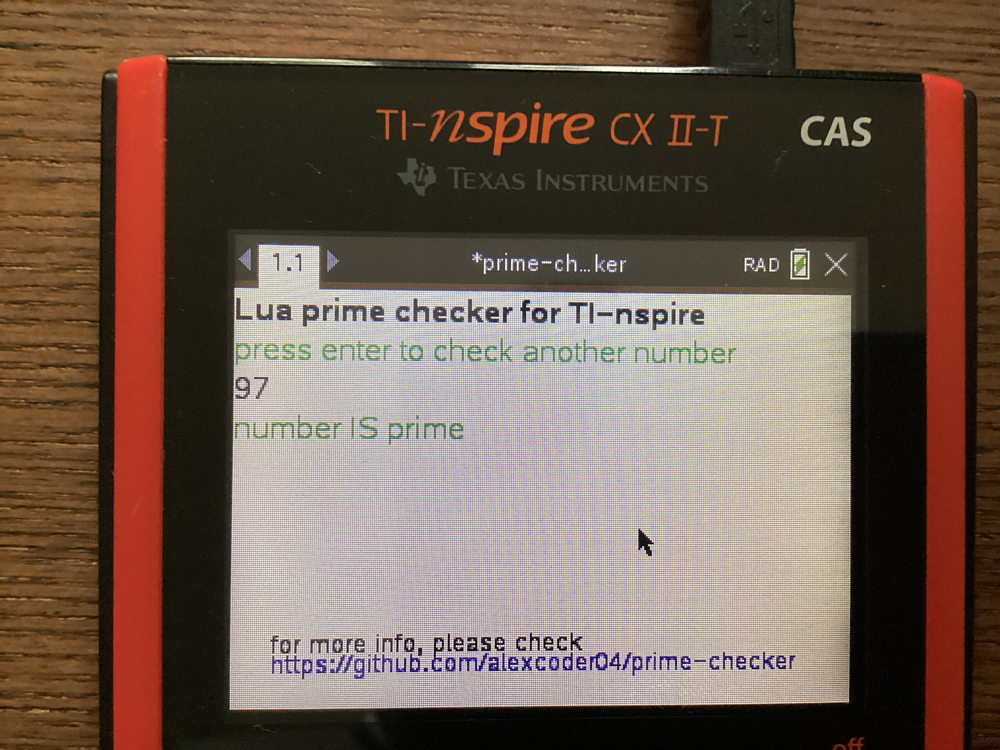
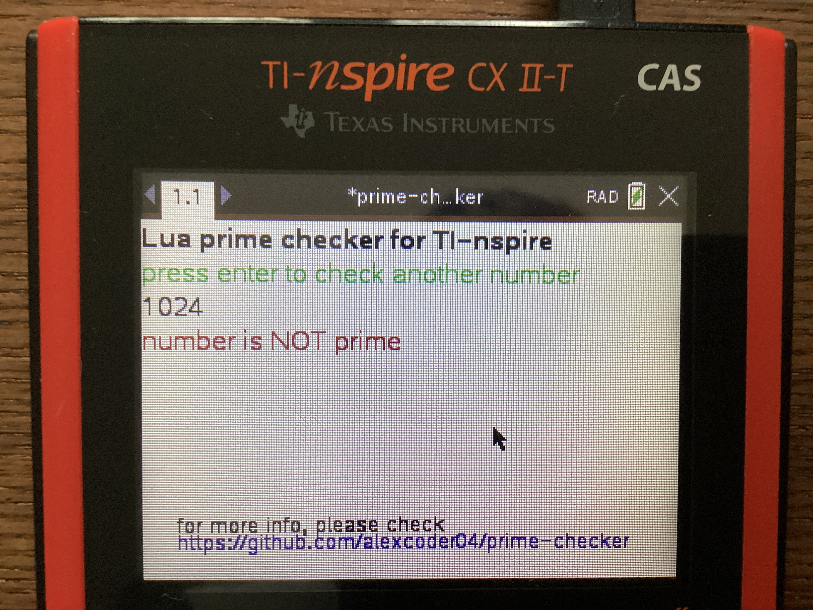

# prime-checker for TI-Nspire

A very simple program to check if a number is prime on the TI-Nspire calculator.

## Method

Just checking all dividers until the square root, using the simple `6k ± 1`
optimization method ([wikipedia](https://en.wikipedia.org/wiki/Primality_test#Example_code)).

## Installation

### Relesases page

For pre-built `.tns`-files, check out the
[latest release](https://github.com/alexcoder04/prime-checker/releases/latest) and copy the
`.tns`-file onto your calculator.

### Compiling yourself

#### Requirements

 - [Luna](https://github.com/ndless-nspire/Luna)
 - [nspire-merge](https://github.com/alexcoder04/nspire-merge)
 - [GNU Make](https://www.gnu.org/software/make/)

#### Building

Running `make clean build` in the project directory will create a `prime-checker.tns` file
which can be copied onto the calculator

## Features to be implemented in the future (maybe)

 - [ ] factorisation into primes
